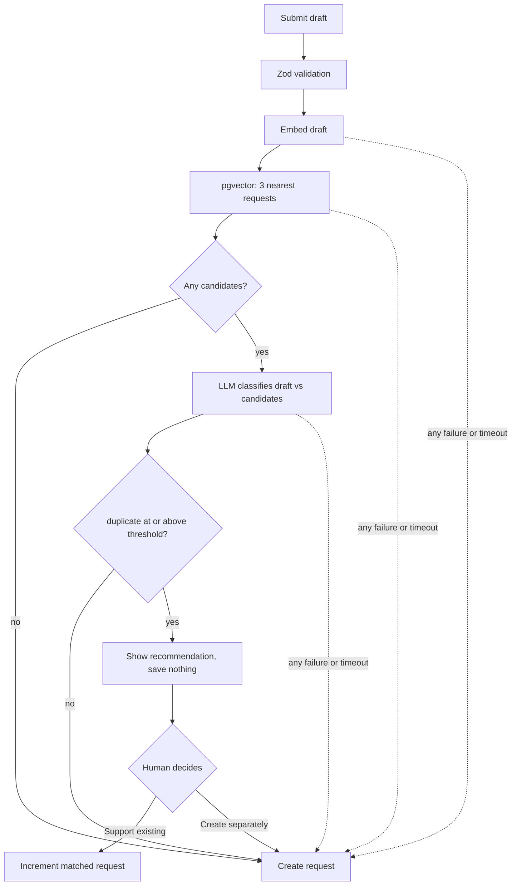

# Feature Intelligence System

Discover, submit, and support product feature requests, with an AI duplicate-triage step that
**recommends** matches at submission time and leaves the decision to the person submitting.

Built with Next.js (App Router), TypeScript, Tailwind CSS, Prisma, PostgreSQL + pgvector, Zod, and
a deliberately small LangGraph workflow.

- [The business problem](#the-business-problem)
- [What this implements](#what-this-implements)
- [Demo](#demo)
- [AI duplicate-triage workflow](#ai-duplicate-triage-workflow)
- [Architecture](#architecture)
- [Technology decisions](#technology-decisions)
- [Human control and fail-open behaviour](#human-control-and-fail-open-behaviour)
- [Setup](#setup)
- [Validation](#validation)
- [Success metrics](#success-metrics-proposed-for-production)
- [Production considerations](#production-considerations)
- [Known limitations and tradeoffs](#known-limitations-and-tradeoffs)

## The business problem

Feature requests arrive continuously and in the customer's own words. The same underlying need
shows up repeatedly under different phrasing — "Export reports as CSV", "Download analytics data in
CSV format", "Let me pull the dashboard numbers into a spreadsheet" — and nothing in a plain request
list connects them.

That fragmentation has a direct cost:

- **Demand signal is diluted.** One need worth 50 votes looks like five separate requests worth 10
  each, so it loses to a louder single request that matters less.
- **Triage does not scale.** Someone has to read every new submission against a growing backlog to
  notice a duplicate. That is the first task dropped when the queue gets long.
- **Customers get worse answers.** A team can ship something already requested twice, or tell a
  customer their idea is new when it has been asked for repeatedly.

Duplicate detection here is not a text-matching problem. "Export reports as CSV" and "Build
customizable dashboards" share vocabulary and users but need different work; "Download analytics
data in CSV format" and "Export dashboard data to CSV" share almost no distinctive wording and are
the same request. Separating those needs judgement about capability and outcome, not string overlap.

## What this implements

A working feature-request board over eight seeded requests, plus triage at the moment of submission:

- **Discover** every request with its support count, newest first.
- **Submit** a request with server-side validation.
- **Triage before saving** — the draft is compared against existing requests, and when one is a
  likely duplicate the submitter is shown the match and asked to choose.
- **Support existing** adds a vote to the matched request and creates nothing, or **Create
  separately** files the draft as its own request.
- **View and support** any request from its detail page.

The AI recommends. It never merges, discards, rewrites, or reprioritises anything on its own.

## Demo

Complete [Setup](#setup) first. The demo assumes the baseline of exactly the eight `seed_*`
requests with embeddings populated:

```sql
SELECT count(*) AS rows,
       count(embedding) AS embedded,
       count(*) FILTER (WHERE id NOT LIKE 'seed\_%') AS extra_rows
FROM "FeatureRequest";
-- expect: rows = 8, embedded = 8, extra_rows = 0
```

1. **Confirm the baseline** with the query above. If rows are missing, `npm run db:seed` inserts
   them; if extra rows exist, see [resetting](#resetting-the-demo-data).
2. **Embed** with `npm run db:backfill-embeddings`. Re-running reports `attempted=0`.
3. **Start** with `npm run dev` and open `/`. Note the two CSV-adjacent requests already present:
   *Download analytics data in CSV format* (18 supporters) and *Export reports as CSV* (32).
4. **Submit the known duplicate** at `/requests/new`:
   - Title: `Export dashboard data to CSV`
   - Description: `Analysts need the raw records behind the dashboard charts in a spreadsheet. Add a
     CSV download that respects the active date range and filters so they do not have to copy values
     out by hand.`
5. **The recommendation appears and nothing has been saved yet.** This is the point worth saying out
   loud — the row is not written, and no vote is cast, until a human chooses. The panel shows the
   matched request, the confidence, and the model's stated reason, with a link to inspect the match.
6. **Explain the two choices.** *Support existing* adds a vote to the matched request and redirects
   to it, consolidating the demand signal. *Create separately* overrides the recommendation, skips
   triage, and files the draft as a new request — the override always wins.
7. **Submit a clearly distinct request** (for example keyboard shortcuts, or dark mode) to show
   triage passing straight through to normal creation with no interruption.
8. **Support a request** from its detail page to show ordinary persistence.

> **On confidence scores.** One live-provider verification run produced a **99% match** naming
> *Download analytics data in CSV format* for the CSV example above. That is an observed result from
> a single run, **not a guaranteed or expected score** — model output varies between runs. The
> product and the test suite depend only on the configured threshold (`>= 0.85`), never on any
> particular score.

Steps 4 and 7 create demo data. Delete the requests you created afterwards so the demo starts from
the same state next time; supporting a *seeded* request instead permanently changes its count, and
`npm run db:seed` will not put it back (see [resetting](#resetting-the-demo-data)).

## AI duplicate-triage workflow

Triage runs when a request is submitted, before anything is written:

1. **Embed the draft.** Title and description are embedded as a single string.
2. **Retrieve candidates.** The three nearest existing requests by pgvector cosine distance.
3. **Classify.** An LLM sees only the draft and those three candidates, and returns
   `duplicate | related | distinct` with a confidence and a short rationale.
4. **Decide what to show.** Only `duplicate` **and** confidence `>= 0.85` produces a recommendation.
   Anything else — including `related` — creates the request normally, because a related request is
   not a duplicate and interrupting the submitter would be noise.

The classifier may only name a request that retrieval actually returned, and its output is
schema-validated before use, so it cannot invent a match. Embeddings stay server-side and are never
included in the state sent to the browser.

## Architecture



The dotted edges are the fail-open path: every AI step degrades to normal creation.

| Layer | Choice | Where |
|---|---|---|
| UI and server | Next.js App Router, Server Actions | `app/`, `components/` |
| Triage workflow | LangGraph `StateGraph` | `lib/ai/triage.ts` |
| Provider wiring | OpenAI SDK, injected into the graph | `lib/ai/triage-service.ts` |
| Retrieval | Raw pgvector query via Prisma | `lib/ai/triage-service.ts` |
| Data access | Prisma Client | `lib/feature-requests.ts` |
| Decision handling | Submission coordinator | `lib/feature-request-submission.ts` |
| Validation | Zod | `lib/feature-request-validation.ts` |

## Technology decisions

**Embeddings + pgvector for candidate retrieval.** Retrieval has to be cheap and bounded on every
submission. Asking an LLM to compare a draft against the whole corpus costs tokens proportional to
the corpus and gets worse as the product succeeds; vector search stays a single indexed-capable
query. Vectors live in a column on the request row, so there is no second datastore to run, sync, or
reconcile — the embedding is written in the same transaction as the request it belongs to.

**The LLM only for semantic duplicate classification.** Cosine similarity is good at "these are
about the same topic" and unreliable at "these ask for the same capability and outcome". The seed
data is built to expose exactly that gap: *Rearrange dashboard widgets* and *Build customizable
dashboards* are neighbours in vector space but are not duplicates. So similarity is used to shortlist
and the LLM to judge — one call, three candidates, a constrained schema. Everything else stays
deterministic code.

**LangGraph, kept intentionally small.** Five nodes and two conditional branches. It is used for an
explicit state machine, a deadline shared across steps, and a single place where failure degrades
safely — not for autonomy. There are no tools, no agent loop, no second agent, and no step that
chooses its own next action, because nothing here needs one. Dependencies are injected, so every
node is testable without a provider.

**Server Actions and progressive enhancement.** The whole flow, including both decision buttons,
works as plain form submissions and therefore functions without client JavaScript.

## Human control and fail-open behaviour

**Nothing is written while a recommendation is on screen.** The suggestion is returned as form
state; the row is created or the vote cast only after an explicit choice. *Create separately* skips
triage entirely — an override is never re-litigated.

**Every AI failure degrades to normal creation.** A missing API key, a timeout, a provider error,
malformed classifier output, or a classifier naming a request that was never retrieved all fall
through to creating the request as if triage had not run. A submission is never lost or blocked
because the AI is unavailable. Failures log a sanitised error name, never provider detail or user
content.

**Latency is bounded.** All steps share one 8-second budget, each step is additionally capped
(embedding 3s, classification 5s), every step's cap is reduced by the time already spent, and
provider retries are disabled so a slow provider cannot multiply the wait. Timeouts are enforced
both by the provider SDK and locally.

Thresholds and models are configurable — see [Setup](#setup).

## Setup

**Prerequisites**

- Node.js 22.13 or newer, in the Node 22 LTS line (`nvm use` reads `.nvmrc`).
- **PostgreSQL with the `pgvector` extension available.** The embedding migration runs
  `CREATE EXTENSION IF NOT EXISTS vector`, which requires the extension to be installed and the
  migrating role to be able to create it. On macOS: `brew install pgvector`.
- An OpenAI API key. Without one the app still runs — triage fails open and every request is
  created normally.

**Steps**

```bash
npm install
cp .env.example .env      # then fill in the values below
npm run db:migrate        # applies migrations, enables pgvector, generates Prisma Client
npm run db:seed           # inserts the eight demo requests
npm run db:backfill-embeddings
npm run dev               # http://localhost:3000
```

**Environment variables** (`.env` is git-ignored — never commit real credentials)

| Variable | Required | Default | Purpose |
|---|---|---|---|
| `DATABASE_URL` | yes | — | PostgreSQL connection string |
| `OPENAI_API_KEY` | no | — | Enables triage. Absent or blank means triage fails open |
| `AI_TRIAGE_EMBEDDING_MODEL` | no | `text-embedding-3-small` | Embedding model, 1536 dimensions |
| `AI_TRIAGE_CLASSIFIER_MODEL` | no | see `.env.example` | Duplicate classifier |
| `AI_TRIAGE_TOTAL_TIMEOUT_MS` | no | `8000` | Budget shared by all triage steps |
| `AI_TRIAGE_EMBEDDING_TIMEOUT_MS` | no | `3000` | Per-step cap for embedding |
| `AI_TRIAGE_CLASSIFICATION_TIMEOUT_MS` | no | `5000` | Per-step cap for classification |

Changing the embedding model or its dimensions requires a schema change and a full re-embed; the
`embedding` column is fixed at `vector(1536)`.

**Database commands**

| Command | Effect |
|---|---|
| `npm run db:migrate` | Applies development migrations and generates Prisma Client |
| `npm run db:seed` | **Inserts only.** Adds any missing `seed_*` rows and leaves everything else untouched — it is safe to re-run, but it is not a reset: it never deletes rows and never corrects a changed support count |
| `npm run db:backfill-embeddings` | Embeds every request whose `embedding` is null. Idempotent; a second run reports `attempted=0`; exits non-zero if any request fails |
| `npx prisma validate` | Validates the schema and database configuration |

### Resetting the demo data

`npm run db:seed` cannot remove requests you created or undo a support count. To get back to a clean
baseline, either:

**Targeted cleanup** — inspect first, then delete only what you added:

```sql
SELECT id, title, "supportCount" FROM "FeatureRequest" WHERE id NOT LIKE 'seed\_%';
-- review the list, then remove those rows
DELETE FROM "FeatureRequest" WHERE id NOT LIKE 'seed\_%';
```

To restore a seeded request's support count, set it back to the value in `prisma/seed.mjs`.

**Full reset** — destructive, for local development and demos only:

```bash
npx prisma migrate reset      # DROPS ALL DATA in the target database, re-migrates, re-seeds
npm run db:backfill-embeddings   # required: the embedding column is recreated empty
```

> Never run `prisma migrate reset` against a shared or production database. It deletes everything in
> the database that `DATABASE_URL` points at.

## Validation

```bash
npm test          # duplicate-triage and submission suites (node:test)
npm run lint      # ESLint
npm run typecheck # tsc --noEmit
npm run build     # production build
```

The tests cover the confidence threshold at its boundaries, rejection of a classifier naming an
unretrieved candidate, malformed classifier output, the shared-deadline arithmetic, fail-open with
retries disabled, both human decision paths, and the guarantee that no embedding vector reaches
client state. They inject fake dependencies, so no provider or database is needed to run them.

## Success metrics (proposed for production)

**These are proposed targets for a production rollout, not measured results.** This is a local
assessment build with no production deployment, no real users, and no labelled evaluation set, so
nothing below has been measured.

| Metric | Definition | Why it matters |
|---|---|---|
| **Median feature-request triage time** | Submission to triage decision — recommendation accepted, overridden, or no duplicate found | The efficiency case. Today this is human queue time and grows with backlog size; triage at submission should make it roughly constant |
| **Duplicate-request creation rate** | Share of newly created requests later judged to duplicate an existing one | The quality case, and the metric the system exists to move. Expected to fall; it is the clearest evidence that demand signal is consolidating |
| **AI duplicate-recommendation acceptance rate** | Share of shown recommendations where the submitter chose *Support existing* | The trust case, and diagnostic in both directions. Persistently low means the threshold is too loose and the panel is training people to dismiss it; very high with few recommendations shown suggests it is too strict and duplicates are slipping through |

The third metric needs the other two to be read correctly: acceptance rate alone can be raised by
showing fewer, safer recommendations, which would not reduce duplicates. Reviewing them together,
against a labelled evaluation set, is what would justify moving the threshold.

## Production considerations

Deliberately **not** implemented here; these are what the next steps would be.

- **Authentication and unique support.** Support is currently an unauthenticated increment, so one
  person can vote repeatedly and counts are not trustworthy. Real accounts and one-support-per-user
  are prerequisites for treating support counts as demand signal.
- **An evaluation dataset for duplicate precision and recall.** The `0.85` threshold is a reasoned
  default, not a tuned one. A labelled set of request pairs would let precision and recall be
  measured, the threshold chosen against a target error balance, and regressions caught.
- **Monitoring of AI latency, cost, and failure rate.** Failing open is correct behaviour but
  currently near-silent: triage could be failing for every submission and the app would look
  healthy. Per-step latency, token spend, timeout rate, and fail-open rate need to be metrics with
  alerts.
- **Approximate vector indexing.** Retrieval is an exact sequential scan, which is the right choice
  at this size. Past roughly tens of thousands of requests an HNSW index would be needed, trading
  some recall for latency — worth adding when data volume justifies it, not before.
- **Model and version evaluation.** Model names are configurable but unpinned, and provider upgrades
  can shift behaviour silently. Production should pin versions and re-run the evaluation set before
  any change.
- **Privacy and sensitive customer feedback.** Request text is sent to a third-party provider for
  embedding and classification, and feature requests routinely contain customer names and internal
  details. Production needs a data-processing agreement, a retention policy, redaction of sensitive
  fields, and possibly self-hosted embeddings.
- **Richer prioritisation and context.** Consolidated demand is the input to prioritisation, not
  prioritisation itself. Underlying-need extraction, themes, and scoring were explicitly out of
  scope for this build. `prisma/schema.prisma` carries unused nullable `underlyingNeed`, `theme`,
  `customerImpact`, `strategicValue`, `urgency`, and `priorityScore` columns from the initial
  migration; no code reads or writes them, and populating them is future work.

## Known limitations and tradeoffs

- **Support counts are not trustworthy** without authentication — anyone can increment repeatedly.
- **Retrieval considers only the three nearest requests.** A duplicate ranked fourth is never seen
  by the classifier. Three keeps the prompt small and cheap; the ceiling is real.
- **The threshold is a judgement call.** `0.85` was chosen to favour precision — a wrong
  recommendation is more damaging to trust than a missed one — but it is untuned.
- **Confidence is the model's self-report,** not a calibrated probability. It is shown to help a
  human judge, and should not be read as an error rate.
- **A request without an embedding is invisible to retrieval.** Requests created while triage is
  failing open are saved without a vector and will not be matched against until backfilled.
- **The recommendation lives in form state.** Reloading the page while it is showing loses it and
  the submitter is asked to submit again; the draft is never written in that state, so nothing is
  lost but the retype.
- **The vector scan is exact and sequential** — correct and simple now, an index later.
- **No search, filtering, or pagination** on the discover list, which is fine for eight requests and
  would not be for eight hundred.
- **Only the submitter sees the duplicate signal.** There is no reviewer queue and no way to merge
  requests that were already created separately.
